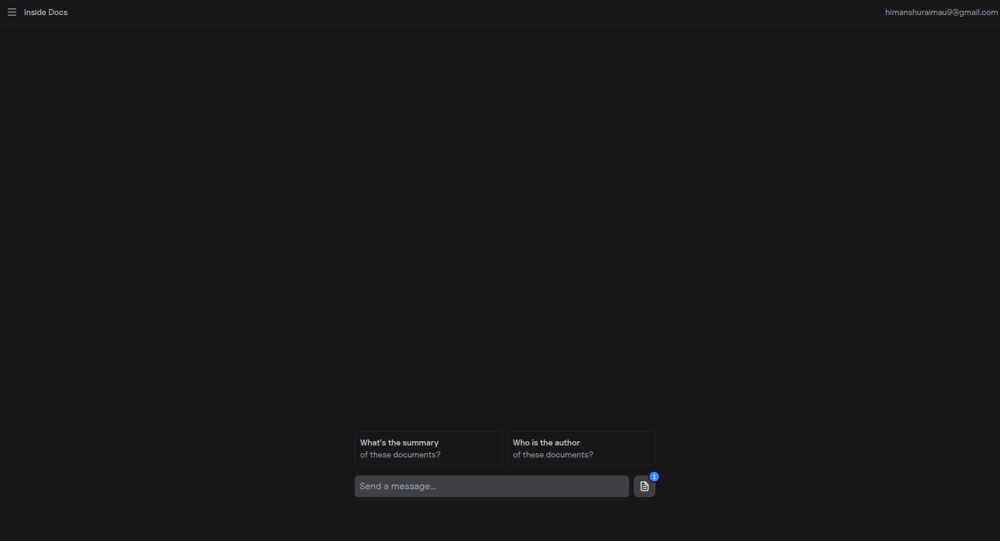

# Inside Docs

A powerful RAG (Retrieval Augmented Generation) application for creating an internal knowledge base with document upload, AI-powered search, and chat functionality. This application leverages the [AI SDK](https://sdk.vercel.ai/docs) and [Next.js](https://nextjs.org/) to provide an efficient way to query your organization's knowledge.



## Features

- **Document Upload**: Upload PDF documents to build your knowledge base
- **AI-powered Retrieval**: Use state-of-the-art RAG techniques to retrieve relevant information
- **Chat Interface**: Interact with your knowledge base through a friendly chat interface
- **User Authentication**: Secure authentication system to protect your data
- **File Management**: Easy management of uploaded documents
- **Chat History**: Keep track of previous conversations
- **Responsive Design**: Works on desktop, tablet, and mobile devices

## Technology Stack

- **Frontend**: Next.js, React, Tailwind CSS, Framer Motion
- **Backend**: Next.js API routes, Postgres (Vercel Postgres)
- **AI**: Vercel AI SDK, OpenAI API
- **Authentication**: NextAuth.js
- **Storage**: Vercel Blob Storage
- **ORM**: Drizzle ORM
- **Deployment**: Vercel

## Getting Started

### Prerequisites

- Node.js 18+ and npm/pnpm
- OpenAI API key
- Vercel account (for Postgres and Blob storage)

### Installation

To run the example locally you need to:

1. Clone this repository and navigate to the project folder
   ```bash
   git clone https://github.com/your-username/inside-docs.git
   cd inside-docs
   ```

2. Sign up for accounts with the AI providers you want to use (OpenAI)

3. Obtain API keys for each provider

4. Create a Vercel Postgres database and Blob storage

5. Set the required environment variables as shown in the `.env.example` file, but in a new file called `.env`:
   ```
   OPENAI_API_KEY=your_openai_api_key
   AUTH_SECRET=your_generated_secret
   BLOB_READ_WRITE_TOKEN=your_blob_token
   POSTGRES_URL=your_postgres_url
   ```

6. Install the required dependencies:
   ```bash
   npm install
   # or
   pnpm install
   ```

7. Run the development server:
   ```bash
   npm run dev
   # or
   pnpm dev
   ```

8. Open [http://localhost:3000](http://localhost:3000) in your browser to see the application

### Database Setup

The application uses Vercel Postgres for data storage. The initial database schema will be automatically created when you run the application for the first time. If you need to run migrations manually, you can use the following command:

```bash
npx tsx migrate.ts
```

This will apply all the migrations defined in the `drizzle` folder.

## Deploy on Vercel

The easiest way to deploy your Inside Docs is to use the [Vercel Platform](https://vercel.com).

[](https://vercel.com/new/clone?repository-url=https%3A%2F%2Fgithub.com%2Fvercel-labs%2Fai-sdk-preview-internal-knowledge-base&env=OPENAI_API_KEY%2CAUTH_SECRET&envDescription=API%20keys%20needed%20for%20application&envLink=https%3A%2F%2Fgithub.com%2Fvercel-labs%2Fai-sdk-preview-internal-knowledge-base%2Fblob%2Fmain%2F.env.example&stores=%5B%7B%22type%22%3A%22blob%22%7D%2C%7B%22type%22%3A%22postgres%22%7D%5D)

## How It Works

### RAG Middleware

The application uses a custom RAG middleware to enhance the AI responses with information from your uploaded documents. The middleware performs the following steps:

1. Classifies the user query to determine if it needs context
2. For questions, generates a hypothetical answer to guide the search
3. Embeds the query using OpenAI's text-embedding model
4. Retrieves relevant document chunks based on cosine similarity
5. Augments the AI prompt with these relevant chunks
6. Generates a comprehensive response using the enhanced context

### Document Processing

When you upload a PDF document:

1. The file is stored in Vercel Blob Storage
2. The PDF content is extracted using pdf-parse
3. The content is split into smaller chunks using LangChain TextSplitters
4. Each chunk is embedded using OpenAI's text-embedding model
5. The chunks and their embeddings are stored in the database for later retrieval

### Authentication

The application uses NextAuth.js for authentication with a custom credential provider. Users can register and login with email and password, which are securely stored in the database.

## Learn More

To learn more about the AI SDK or Next.js by Vercel, take a look at the following resources:

- [AI SDK Documentation](https://sdk.vercel.ai/docs)
- [Language Model Middleware](https://sdk.vercel.ai/docs/ai-sdk-core/middleware#language-model-middleware)
- [Next.js Documentation](https://nextjs.org/docs)
- [Vercel Postgres Documentation](https://vercel.com/docs/storage/vercel-postgres)
- [Vercel Blob Storage Documentation](https://vercel.com/docs/storage/vercel-blob)

## Contributing

Contributions are welcome! Please feel free to submit a Pull Request.

## License

This project is licensed under the MIT License - see the LICENSE file for details.


